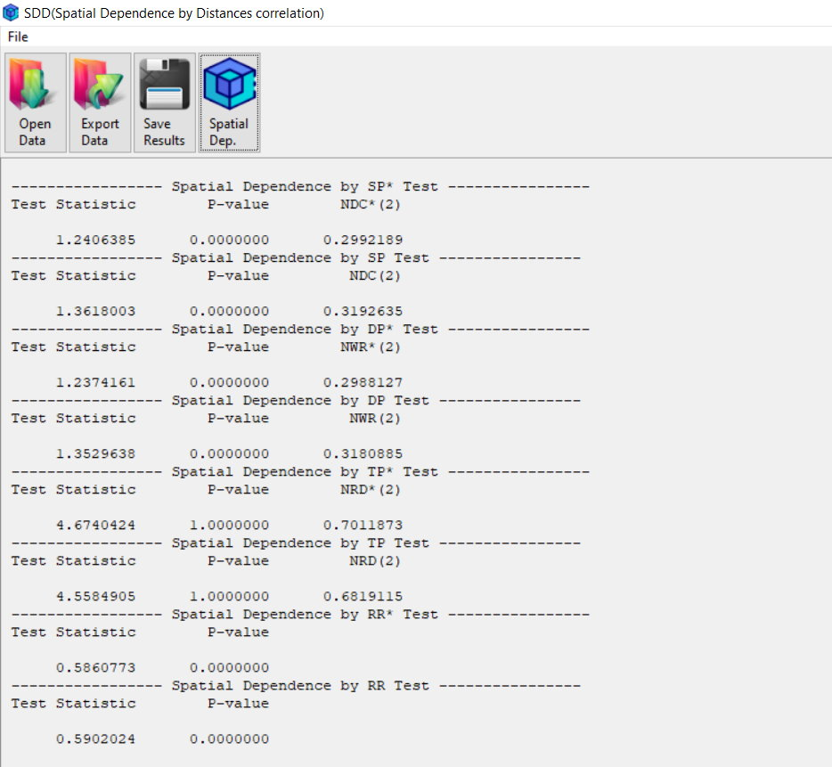
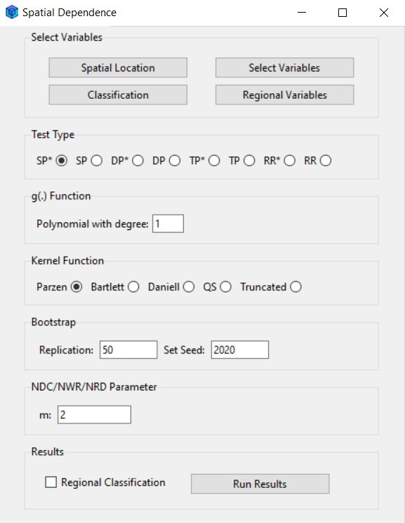

# SDD: Software for Multivariate Spatial Dependence Detection via Distance Correlation
SDD is an open-source software tool developed in R, featuring an independent graphical user interface (GUI). It is designed for measuring and testing spatial dependence in multivariate spatial data. The tool is recognized as software due to its standalone GUI, ensuring ease of use for both researchers and practitioners.

  <table cellpadding="10" cellspacing="0" style="border: 2px solid lightgray; border-collapse: collapse;">
    <tr>
      <td align="center" style="border: 1px solid lightgray;">
        
      </td>
      <td align="center" style="border: 1px solid lightgray;">
        
      </td>
    </tr>
  </table>

# Installation

To install the **SDD** software, follow these steps:

1. First, download the setup file from the link below:  
   [Download SDD2024.exe](https://statisme.com/Content/softs/SDD2024.exe)

2. After downloading, you can refer to the attached guide file available on [Installation Guide for SDD Software]([Installation Guide for SDD Software](https://github.com/emaad7/SDD/blob/main/Installation%20Guide%20for%20SDD%20Software.pdf)) for detailed installation instructions. This file contains the complete installation steps and troubleshooting tips.

3. Run the `SDD2024.exe` file and follow the installation wizard. If you encounter any security warnings (such as from Microsoft Defender SmartScreen), you can proceed by clicking "More info" and then "Run anyway."

4. Once the installation is complete, the software will be ready to use.
