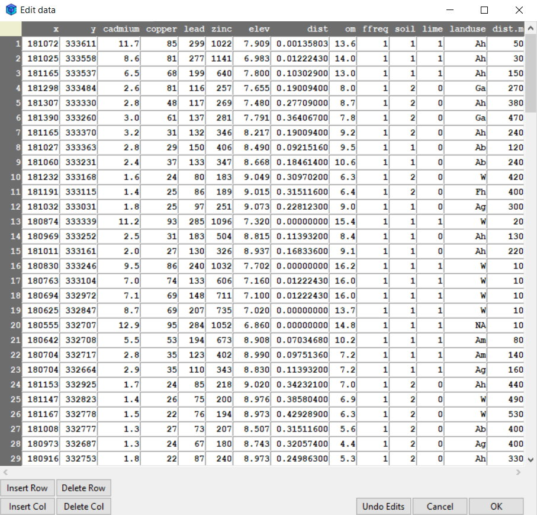
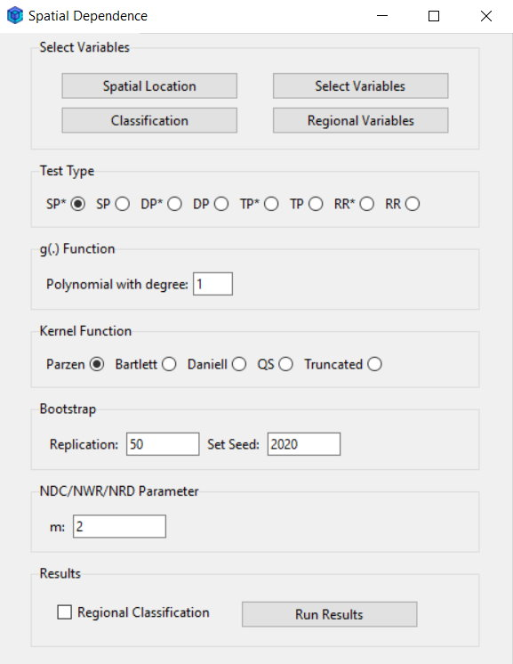
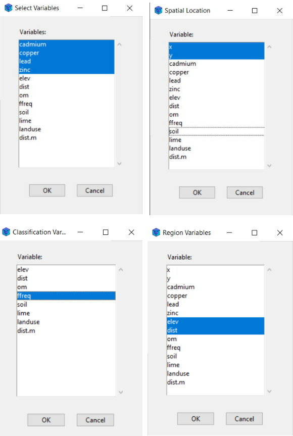
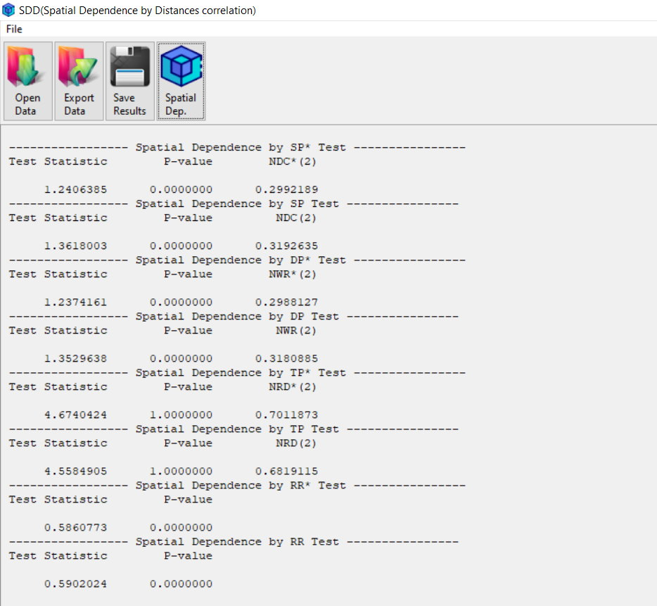

# Summary

SDD (Spatial Dependence by Distance Correlation) is an open-source software tool developed in R, featuring an independent graphical user interface (GUI). It is designed for measuring and testing spatial dependence in multivariate spatial data. The software implements robust statistical methods based on distance correlation, a measure of dependence between random vectors introduced by @Szekely2007. SDD is particularly useful for detecting spatial dependence, trends, and region-specific dependencies in high-dimensional datasets. Its user-friendly interface supports data import, analysis, and reporting, making it accessible to researchers in spatial statistics, environmental science, and related fields. The tool is recognized as software due to its standalone GUI, ensuring ease of use for both researchers and practitioners.

# Statement of Need

Spatial data analysis often involves assessing the dependence between observations collected across different locations. Traditional methods for testing spatial dependence, such as Moran's I (@Moran1950) and Geary's C (@Geary1954), are limited to univariate data and linear relationships, while maximum likelihood-based approaches (@Anselin2001) and instrumental variable methods (@Kelejian2007) may suffer from model misspecification issues. Non-parametric techniques like entropy-based tests (@Lopez2010) or symbolic correlation approaches (@deGraaff2001) require large sample sizes to maintain statistical power, making them less practical for small datasets.

Distance correlation (@Szekely2007) has emerged as a robust alternative for dependence testing, capturing both linear and non-linear relationships. It has been successfully applied to multivariate dependence analysis (@Szekely2009), time series modeling (@Zhou2012; @Fokianos2017; @Edelmann2019), and spatial statistics (@Andreano2019). Despite these advancements, existing spatial dependence tests based on distance correlation are either computationally intensive (e.g., Brownian distance covariance; @Szekely2009) or not specifically designed for multivariate spatial settings.

SDD software addresses these limitations by providing an efficient and user-friendly implementation of novel spatial dependence tests based on distance correlation. Specifically, SDD introduces:

- **Multivariate Analysis**: SDD can handle multivariate spatial data, making it suitable for complex datasets with multiple variables.
- **Non-linear Dependence Detection**: The software uses distance correlation, which can detect both linear and non-linear dependencies.
- **Robustness Across Sample Sizes**: SDD performs well across various sample sizes and dimensions, making it versatile for different research scenarios.
- **Region-Specific Dependence Testing**: SDD includes tests for region-specific dependencies, allowing researchers to account for spatial trends and non-stationarity.

These features address the limitations of existing tools and provide researchers with a comprehensive solution for spatial dependence analysis.

# Methods Implemented

The distance correlation between $\mathbf{X}$ and $\mathbf{Y}$, denoted as $R(\mathbf{X}, \mathbf{Y})$, introduced by @Szekely2007, measures the dependence between two random vectors. Partial distance correlation, $R(\mathbf{X}, \mathbf{Y}; \mathbf{Z})$, introduced by @Szekely2014, measures the dependence between two random vectors $\mathbf{X}$ and $\mathbf{Y}$ after controlling for a third vector $\mathbf{Z}$. There are two types of estimators for distance dependence: one based on @Szekely2007 and the other on @Szekely2013a. These are distinguished by an asterisk in the results and are denoted by $R_n$ and $R_n^\*$, respectively.

The neighborhood dependence indices measure the dependence between observations and their spatial neighbors:

$$SR_{\mathbf{n}}(\mathbf{k}) = R_n (\mathbf{Z(s,k),Z(s)}), \quad SR^\*_{\mathbf{n}}(\mathbf{k}) = R^\*_n (\mathbf{Z(s,k),Z(s)})$$

where $\mathbf{Z(s,k)}$ represents observations in the $\mathbf{k}$-th neighborhood. To remove regional trends and isolate spatial dependence, we define de-trended indices:

$$DR_{\mathbf{n}}(\mathbf{k}) = R_n(\mathbf{Z(s,k),Z(s)};  g\mathbf{(s)}), \quad DR^\*_{\mathbf{n}}(\mathbf{k}) = R^\*_n(\mathbf{Z(s,k),Z(s)}; g\mathbf{(s)})$$

where $g\mathbf{(s)}$ represents a trend function. The contribution of regional trends to dependence is measured using trend indices:

$$TR_{\mathbf{n}}(\mathbf{k}) = 1 - DR_{\mathbf{n}}(\mathbf{k}), \quad TR_{\mathbf{n}}^\*(\mathbf{k}) = 1 - DR_{\mathbf{n}}^\*(\mathbf{k}).$$

To assess dependence influenced by external factors, regional dependence indices incorporate regional variables $\mathbf{Y(s)}$:

$$RR_{\mathbf{n}} = R_n(\mathbf{Z(s), Y(s)}), \quad RR^\*_{\mathbf{n}} = R^\*_n(\mathbf{Z(s), Y(s)}).$$

Aggregated measures over multiple neighborhoods are calculated by averaging the spatial dependence values of specific measures across $m$ neighborhoods. Specifically, $NDC(m)$ and $NDC^\*(m)$ represent the averages of the spatial dependence values $SR_{\mathbf{n}}(\mathbf{k})$ and $SR_{\mathbf{n}}^\*(\mathbf{k})$ for $m$ neighborhoods, respectively. Similarly, $NWR(m)$ and $NWR^\*(m)$ are the averages of $DR_{\mathbf{n}}(\mathbf{k})$ and $DR_{\mathbf{n}}^\*(\mathbf{k})$, while $NRD(m)$ and $NRD^\*(m)$ are the averages of $TR_{\mathbf{n}}(\mathbf{k})$ and $TR^\*_{\mathbf{n}}(\mathbf{k})$. These indices offer a comprehensive approach to evaluating spatial dependence in multivariate data.

Using the approach of @Fokianos2017, the test statistics $SP$,  $SP^\*$, $DP$, $DP^\*$, $TP$, $TP^\*$, $RR$, and $RR^\*$ are formulated as weighted sums of spatial dependence measures across multiple neighborhoods. These statistics incorporate kernel-based weighting functions to enhance sensitivity to spatial patterns. The formulation involves aggregating dependence measures over a set of indices determined by the sample structure, where the weighting is controlled by a kernel function. Several common kernel functions, such as "Truncated", "Bartlett", "Daniell", and "Parzen", can be employed to adjust the influence of different neighborhood scales (@Hong1999).

The bootstrap procedure estimates the test statistic's distribution by permuting the original dataset, resampling, and computing P-values, and it is used for spatial dependence testing.

# Key Features

1. **Data Import and Editing**: SDD supports multiple data formats, including text files (.txt, .csv), SAS (.sas7bdat), STATA (.dta), SPSS (.sav, .zsav, .por), and Excel (.xls, .xlsx). Users can easily import, edit, filter, and export data within the software(see ‎Figure ‎‎1a)‎.

2. **Spatial Dependence Tests**: SDD implements several tests for spatial dependence, including(see ‎Figure ‎‎1b):
   - $SP$ and $SP^\*$: Tests for spatial dependence, trends, or both.
   - $DP$ and $DP^\*$: Tests for spatial dependence.
   - $TP$ and $TP^\*$: Tests for trends (non-stationarity).
   - $RR$ and $RR^\*$: Tests for region-specific dependence based on regional variables.

   If the P-value is less than the alpha level, the null hypothesis is rejected, indicating the presence of the respective spatial dependence or trend ($SP$ and $SP^\*$), spatial dependence ($DP$ and $DP^\*$), trend ($TP$ and $TP^\*$), and region-specific dependence ($RR$ and $RR^\*$).

3. **Bootstrap Procedure**: The software includes a bootstrap method for conducting dependence tests. Users can set parameters such as the number of replications (B) and a seed value to ensure reproducibility.

4. **Kernel Functions**: Users can specify different kernel functions for the tests, including: Truncated, Bartlett, Daniell, Parzen.

5. **NDC/NWR/NRD Parameters**: SDD allows users to specify the parameter $m$ for neighborhood distance correlation (NDC), neighborhood distance correlation without region dependence (NWR), and neighborhood region dependence (NRD).

6. **Results and Reporting**: The results of the tests are displayed in the main panel of the software. Users can save the results in text or Microsoft Word format for further analysis and reporting(see ‎Figure ‎‎1d).

<table>
  <tr>
    <td align="center">
      
       
      <b> (a) </b> Edit Data
    </td>
    <td align="center">
      
       
      <b> (b) </b> Spatial Dependence window
    </td>
  </tr>
  <tr>
    <td align="center">
      
       
      <b> (c) </b> Select variables
    </td>
    <td align="center">
      
       
      <b> (d) </b> Main panel
    </td>
  </tr>
</table>

**Figure 1:** SDD Software

  
# Practical Example: Meuse River Data

The article provides a practical example using the Meuse River dataset, which includes measurements of heavy metals (Cu, Cd, Pb, Zn) along with their spatial locations and covariates. The dataset is available in the `sp` package of R. The method for selecting variables and its output are presented in Figures 1c and 1d.

## Results of Spatial Dependence Tests

The tests $SD^\*$ and $SD$ reject $H_0$ with a P-value of 0.000. The indices $NDC^\*$ and $NDC$ were found to be 0.299 and 0.319, respectively. To determine whether this rejection was due to dependence or a trend in the data, we applied the $DP^\*$ and $DP$ tests. Based on a first-degree polynomial function, these tests confirmed spatial dependence in heavy metal distribution (P-value = 0.000). The dependence indices $NWR^\*$ and $NWR$ were 0.299 and 0.318, respectively. However, the $TP^\*$ and $TP$ tests indicated stationarity in the region, as their P-values equaled 1.000.

Heavy metal distribution appears influenced by sediment transport and deposition patterns, especially in low-elevation areas near the riverbank. The $RR^\*$ and $RR$ tests confirmed strong regional dependence, with values of 0.586 and 0.590, and a significant P-value of 0.000, suggesting an association with elevation and river proximity.

We hypothesize that flooding frequency affects spatial dependence. When incorporating this classification, the regional dependence assessment indicated an increase in $SD^\*$, $SD$, $DP^\*$, and $DP$ values, reaching 0.515, 0.527, 0.514, and 0.527, respectively. Notably, this classification revealed a trend in the data, as detected by the $TP^\*$ and $TP$ tests.

# Availability

The SDD software is available on [StatisSoft](https://statisme.com/Home/StatisSoftList), which provides access to the software, its manual, and the data used in the article.
# Conclusion

SDD is a powerful and user-friendly tool for measuring and testing spatial dependence in multivariate spatial data. It implements robust methods based on distance correlation and offers a comprehensive set of features for data analysis and reporting. The software is particularly useful for researchers working with high-dimensional spatial data.

# References
